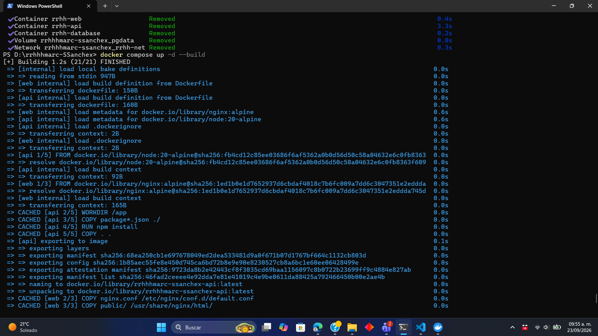
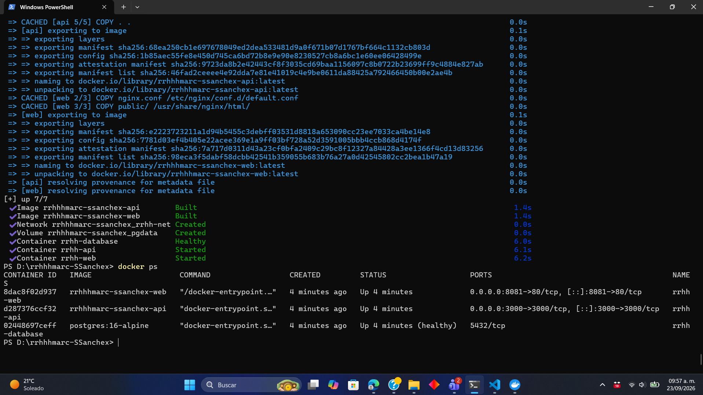
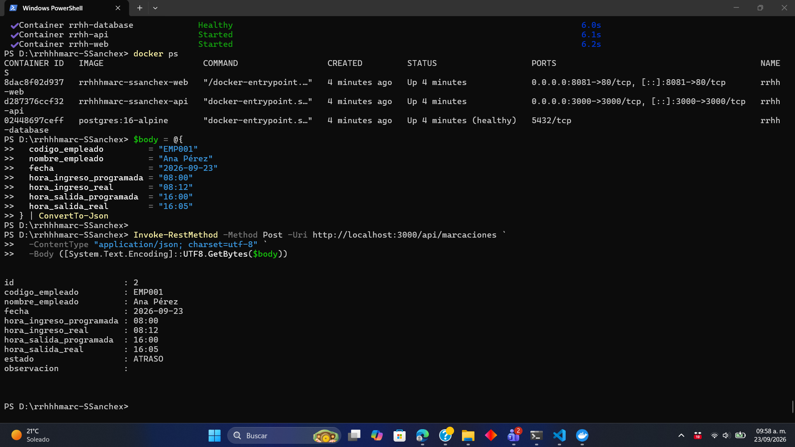
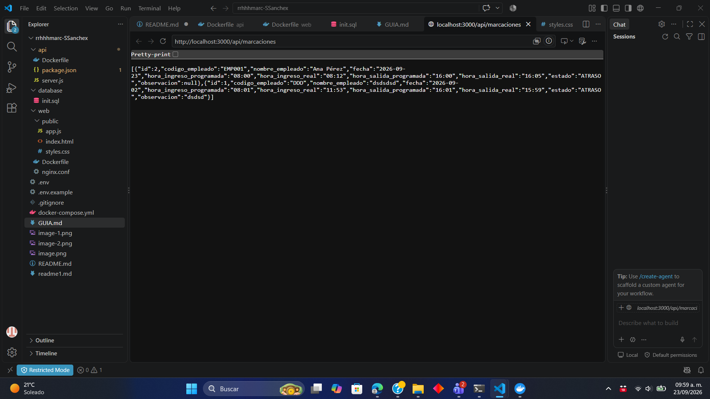
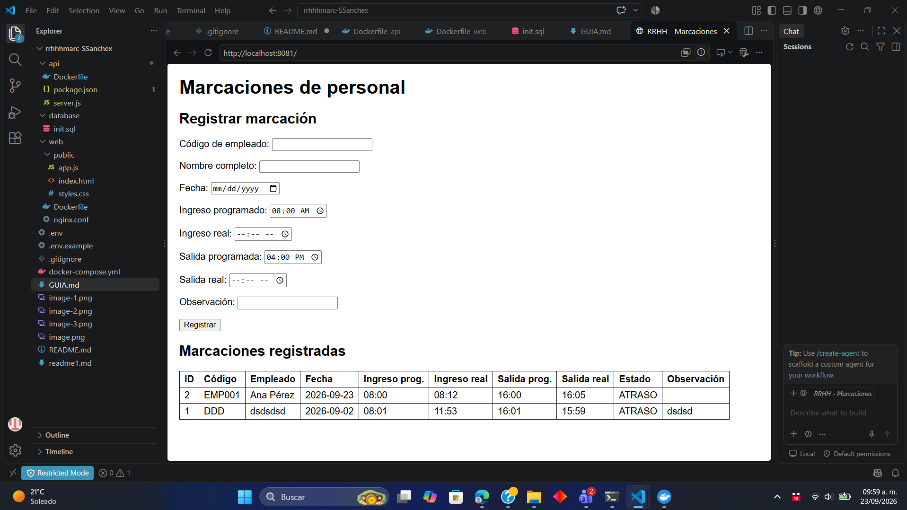
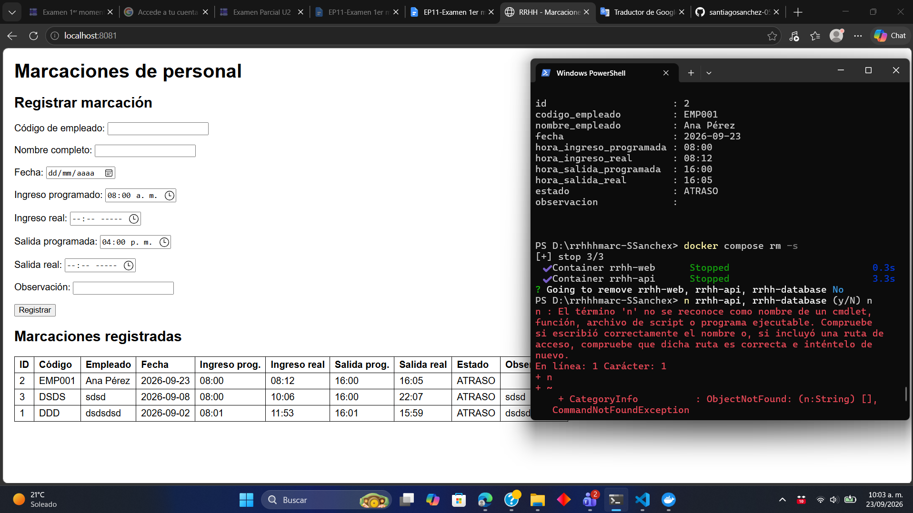
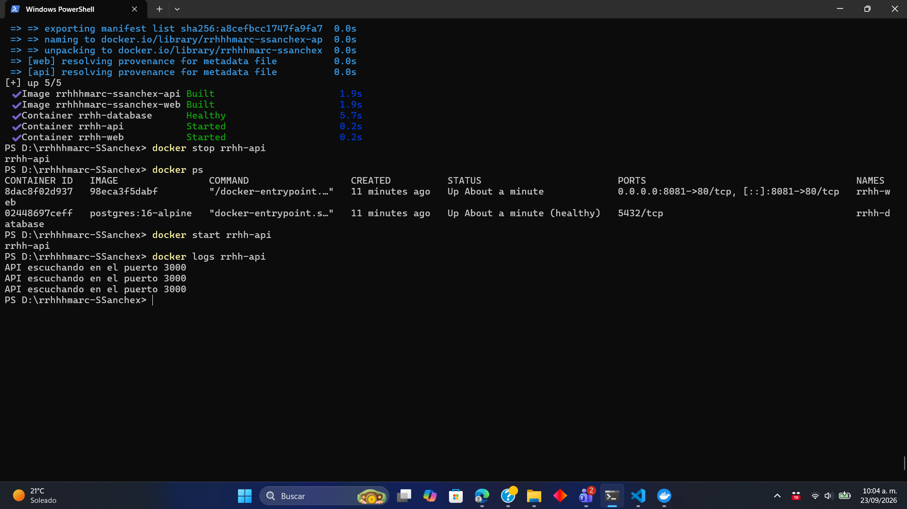

# rrhhhmarc-SSanchex – Marcaciones de personal

Aplicación multicontenedor (Web + API REST + PostgreSQL) para registrar y consultar marcaciones de empleados.

## Arquitectura
Usuario → **web** (nginx :8080) → **api** (Node/Express :3000) → **database** (PostgreSQL 16)
Red privada `rrhh-net`, volumen `pgdata`.

## Requisitos
Docker y Docker Compose.

## Cómo ejecutar
```bash
git clone https://github.com/<usuario>/rrhhhmarc-SSanchex.git
cd rrhhhmarc-SSanchex
cp .env.example .env      # editar DB_PASSWORD
docker compose up -d --build
```
- Web: http://localhost:8080
- API: http://localhost:3000/api/marcaciones

## Endpoints
| Método | Ruta | Descripción |
|---|---|---|
| GET | /api/marcaciones | Lista (filtros `?empleado=` y `?fecha=`) |
| GET | /api/marcaciones/{id} | Una marcación |
| POST | /api/marcaciones | Crear (201) |
| PUT | /api/marcaciones/{id} | Modificar |
| DELETE | /api/marcaciones/{id} | Eliminar |

## Reglas de estado
- INCOMPLETO: falta la hora real de ingreso o de salida
- ATRASO: ingreso real > programado + TOLERANCIA_MIN
- SALIDA_ANTICIPADA: salida real < salida programada
- PUNTUAL: en otro caso

## DNS interno
docker stop rrhh-api
docker ps

- **Afectación:** la web sigue cargando en http://localhost:8080, pero la tabla muestra *"El servicio API no está disponible"* (HTTP 503 que devuelve nginx). No se puede registrar ni consultar.
- **Qué sigue funcionando:** `rrhh-web` (nginx sirve la página) y `rrhh-database` (healthy, con los datos intactos).
- **Restaurar:**
powershell
docker start rrhh-api
docker logs rrhh-api     # "API escuchando en el puerto 3000"

## Evidencias
Prueba 1

Prueba 2

Prueba 3

Prueba 4

Prueba 5

Prueba 6 (Persistecia)

Prueba 7

